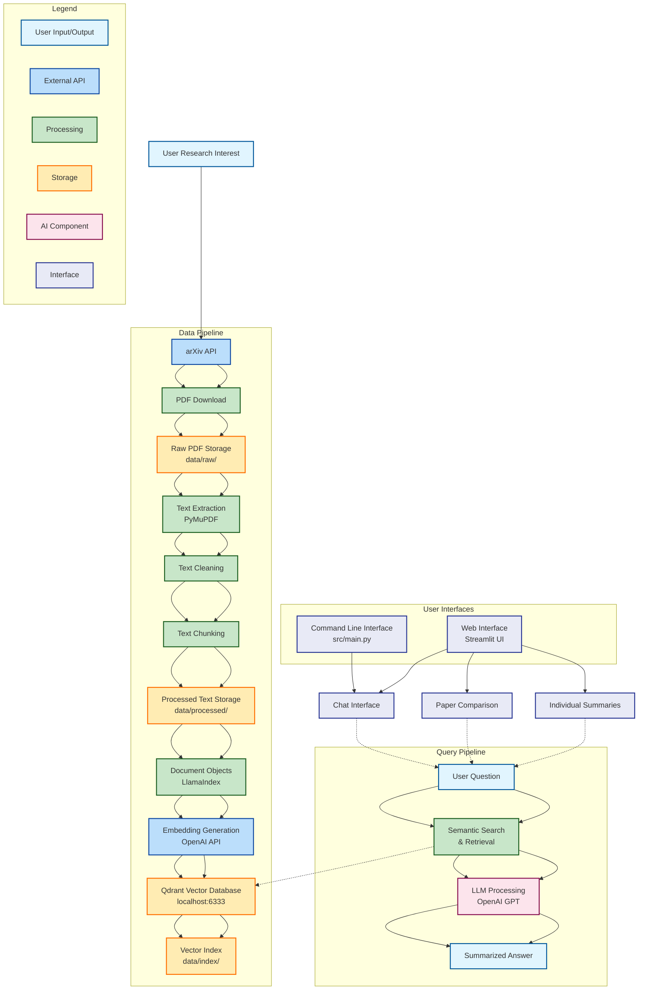

Research Copilot 🔬

A powerful AI-powered research assistant that helps you discover, analyze, and query academic papers from arXiv. Built with LlamaIndex and Qdrant for intelligent document retrieval and question-answering.
Features

    📥 Paper Ingestion: Automated download of research papers from arXiv API

    🔍 Text Processing: PDF text extraction, cleaning, and intelligent chunking

    🧠 Vector Indexing: Qdrant-based vector storage with OpenAI embeddings

    💬 Natural Language Querying: Ask questions about your research papers

    📊 Streamlit UI: User-friendly interface for paper management and exploration

    📄 Individual Summarization: Get AI-generated summaries of specific papers

    🔍 Multi-Paper Comparison: Compare methodologies and findings across multiple papers

Project Structure
```bash
research-copilot/
├── .env                  # API keys, DB URL, etc.
├── README.md             # This file
├── requirements.txt      # Python dependencies
├── data/
│   ├── raw/              # Downloaded PDFs
│   ├── processed/        # Extracted & cleaned text chunks
│   └── index/            # Vector DB metadata
├── src/
│   ├── __init__.py
│   ├── main.py           # CLI entry point
│   ├── ui.py            # 5.Streamlit web interface
│   ├── ingest.py         # 1.Fetch + download papers
│   ├── preprocess.py     # 2. chunker
│   ├── indexer.py        # 3.embedding
│   ├── query.py          # 4.Query engine + summarization
│   └── utils.py          # Common helpers
└── notebooks/
    └── playground.ipynb  # Experiments
```

Prerequisites

    Python 3.8+

    Docker (for Qdrant)

    OpenAI API key

Installation

    Clone and setup environment:
```bash
git clone <your-repo-url>
cd research-copilot
python -m venv venv
source venv/bin/activate  # Linux/Mac
# or
venv\Scripts\activate     # Windows
```

    Install dependencies:
```bash
uv pip install -r requirements.txt
```

    Setup Qdrant with Docker:
```bash
docker run -p 6333:6333 -p 6334:6334 qdrant/qdrant
```

    Configure environment:
```bash
cp .env.example .env
# Edit .env with your OpenAI API key
```


Quick Start
CLI Interface

    
```bash
#Download papers:
python -m src.main ingest "transformer architecture" --max-results 5

#Process papers:
python -m src.main preprocess

#Build index:
python -m src.main index

#Query your papers:
python -m src.main query "What are the key innovations in transformer architecture?"
```

Web Interface
```bash
# Launch the Streamlit UI
python -m src.main ui
# or
streamlit run src/ui.py
```

Web Interface Features

    Chat Interface: Natural conversation with your research papers

    Paper Library: Browse and manage downloaded papers

    Individual Summaries: Get detailed summaries of specific papers

    Comparative Analysis: Compare methodologies across multiple papers

    Visual Statistics: See download and processing metrics


